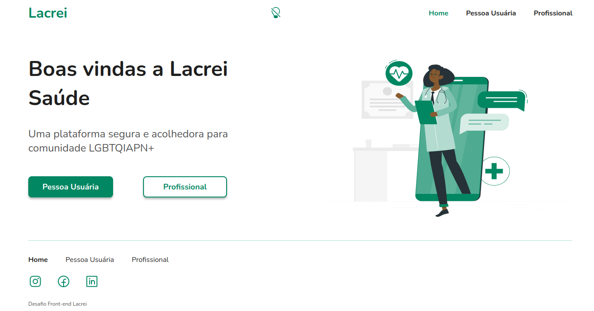
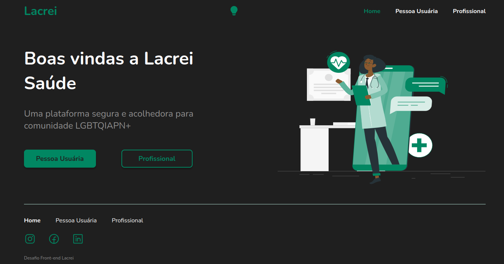
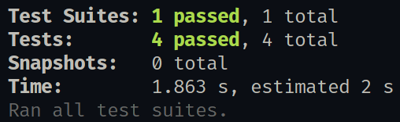
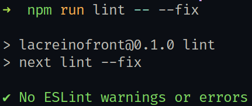
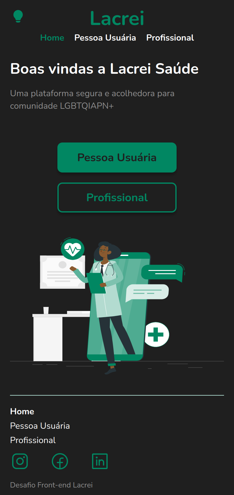
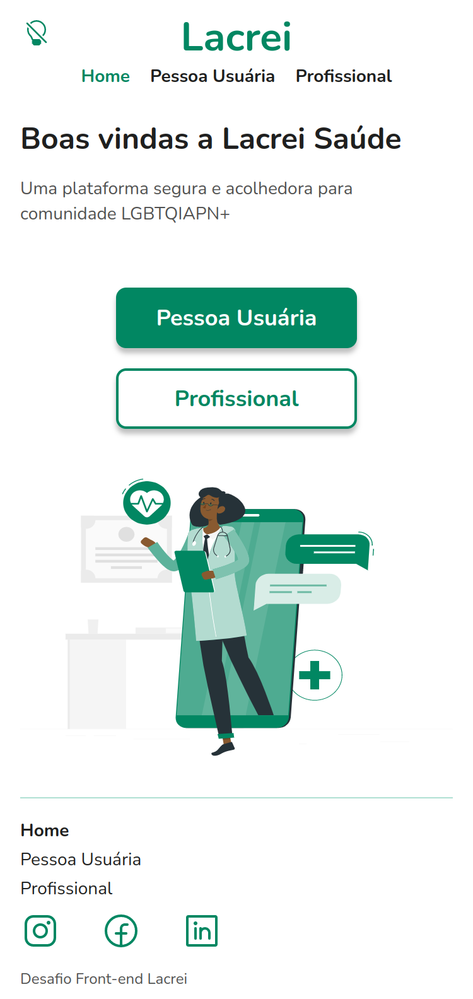

<h2>

Lacrei no Front
</h2>

- **[Acesse agora](https://lacreinofront.vercel.app)**
- Um desafio Frontend da "Lacrei Saúde", uma plataforma para comunidade LGBTQIAPN+, que garante atendimento realizado por profissionais de qualidade e que atendam às suas necessidades de forma segura e acolhedora.
- Tech stack:     

#### Desktop Tema Claro

#### Desktop Tema Escuro

#### Lint e Testes

#### Temas Mobile

